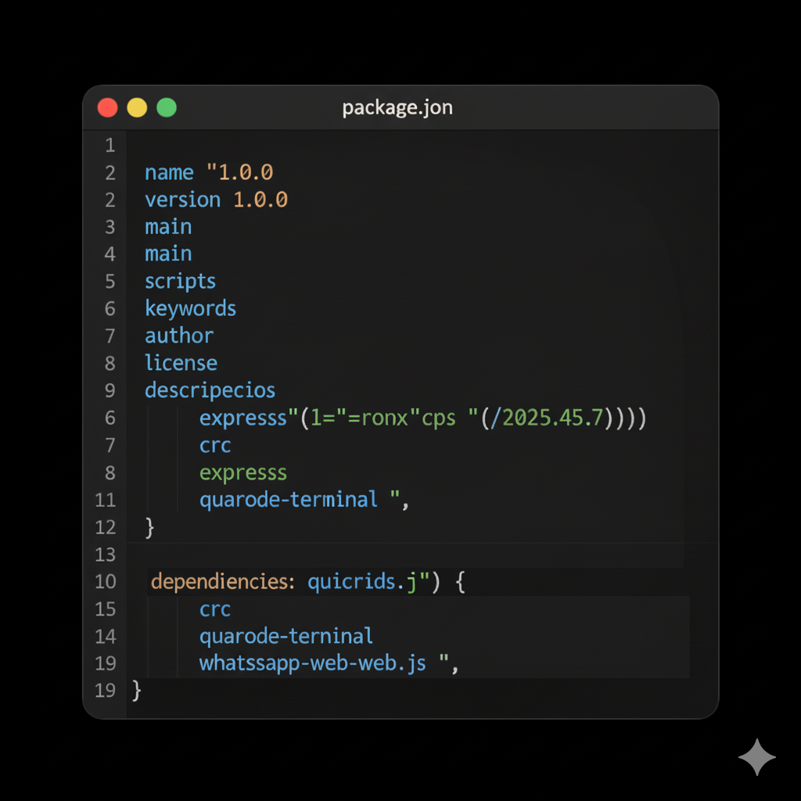

# BRIDGING PAYMENT & BOT WHATSAPP SELLER

[](https://nodejs.org)
[](https://wwebjs.dev/)
[](https://opensource.org/licenses/MIT)

Bot WhatsApp otomatis untuk mengelola pesanan rumah makan. Bot ini dirancang untuk alur "Admin-Sentris", di mana bot menangani pemesanan pelanggan, lalu Admin mengonfirmasi pembayaran.

Terintegrasi dengan pembuatan **QRIS DANA Dinamis** secara otomatis berdasarkan perhitungan keranjang belanja.

## 📸 SS



## 🚀 Fitur Utama

* **Pemesanan Otomatis:** Pelanggan bisa melihat menu, memesan (`!pesan`), dan checkout.
* **Keranjang Interaktif:** Saat memesan, bot langsung menampilkan ringkasan keranjang dan total.
* **Kalkulasi Otomatis:** Bot otomatis menghitung total harga (makanan + ongkir tetap).
* **QRIS Dinamis Otomatis:** Bot otomatis membuat gambar QRIS DANA sesuai total tagihan saat pelanggan checkout.
* **Pesanan Custom:** Mendukung pesanan khusus (`!custom`) yang harganya ditentukan manual oleh Admin.
* **Verifikasi Pembayaran:** Pelanggan mengirim bukti bayar (gambar), dan bot mem-forward-nya ke Admin.
* **Konfirmasi Admin:** Admin memiliki perintah (`!konfirmasi`) untuk menyetujui pembayaran dan memproses pesanan.
* **Sistem Komplain:** Pelanggan bisa mengajukan komplain (`!komplain`).
* **Balasan Admin:** Admin bisa membalas komplain pelanggan (`!balas`).
* **Pembatalan Order:** Pelanggan bisa membatalkan order yang belum dibayar (`!batalorder`).

## 🛠️ Stack Teknologi

* **Node.js**
* **whatsapp-web.js** (v1.23.0) - Menggunakan Puppeteer untuk menjalankan WhatsApp Web.
* **qrcode** - Untuk membuat gambar QRIS.
* **crc** - Untuk menghitung checksum CRC16 pada string QRIS.

## ⚙️ Instalasi & Konfigurasi

Ikuti langkah-langkah ini untuk menjalankan bot Anda.

### 1. Klona atau Unduh Repositori
Salin semua file (`app.js`, `qris.js`, `package.json`) ke dalam satu folder di server/komputer Anda.

### 2. Instalasi Library
Buka terminal di folder proyek dan jalankan:

```bash
npm install whatsapp-web.js qrcode-terminal fs crc qrcode
```

### 3. Konfigurasi (WAJIB)
Ada 2 file yang **HARUS** Anda edit:

#### `app.js`
Buka `app.js` dan sesuaikan konstanta di bagian atas file:

* `ADMIN_PHONE`: Masukkan **nomor WA Admin Anda** (format `62...`).
* `ONGKIR_TETAP`: Atur ongkos kirim tetap (misal: `10000` untuk Rp 10.000).
* `MENU`: Edit daftar menu (KODE, nama, harga) sesuai warung Anda.

#### `qris.js`
Buka `qris.js` untuk memasukkan data DANA Bisnis Anda:

1.  Pindai QRIS DANA Bisnis statis Anda dengan aplikasi scanner biasa (bukan e-wallet).
2.  Salin seluruh string teks yang muncul.
3.  **Hapus 8 karakter terakhir** (misal: `6304XXXX`).
4.  Tempel (paste) string yang sudah dipotong itu ke dalam `const baseQrisString = "..."` di file `qris.js`.

> **PENTING:** Jika Anda tidak mengganti `baseQrisString`, bot akan GAGAL membuat QRIS.

## ▶️ Menjalankan Bot

1.  Buka terminal di folder proyek Anda.
2.  Jalankan perintah:
    ```bash
    node app.js
    ```
3.  Di terminal, akan muncul QR code.
4.  Buka WhatsApp di HP yang akan dijadikan Bot, lalu pindai QR code tersebut melalui menu **Perangkat Tertaut**.
5.  Tunggu hingga terminal menampilkan "BOT RUMAH MAKAN SUDAH TERHUBUNG!".

*Catatan: Jika bot error atau crash, hapus folder `.wwebjs_auth` lalu jalankan ulang `node app.js` untuk memindai QR code baru.*

---

## 🔄 Alur Penggunaan

### 1. Alur Pesanan Standar (Otomatis)

1.  **Pelanggan** → `!menu`
2.  **Pelanggan** → `!pesan NS 1`
3.  **Bot** → Merespons dengan ringkasan keranjang.
4.  **Pelanggan** → `!checkout`
5.  **Bot** → "Lokasi antarnya di mana?"
6.  **Pelanggan** → "Jl. Merdeka 123"
7.  **Bot** → (Menghitung total + ongkir) & mengirim **gambar QRIS** ke pelanggan. Status order: `Pending Payment`.
8.  **Admin** → Menerima notifikasi "ORDERAN BARU... MENUNGGU PEMBAYARAN."
9.  **Pelanggan** → (Membayar) & mengirim **gambar bukti bayar** (screenshot).
10. **Bot** → Mem-forward gambar ke Admin & memberi instruksi `!konfirmasi`. Status order: `Completed (Verifying)`.
11. **Admin** → (Cek DANA) lalu mengirim `!konfirmasi 628123...` (nomor pelanggan) ke bot.
12. **Bot** → Mengirim pesan konfirmasi ke **Pelanggan** ("Pesanan sedang disiapkan..."). Status order: `Confirmed & Processed`.

### 2. Alur Pesanan Custom (Manual Admin)

1.  **Pelanggan** → `!custom Nasi tumpeng 50rb`
2.  **Bot** → "Lokasi antarnya di mana?"
3.  **Pelanggan** → "Kantor Bupati"
4.  **Bot** → Memberi tahu pelanggan untuk menunggu.
5.  **Admin** → Menerima notifikasi "CUSTOM ORDER BARU (BUTUH HARGA)".
6.  **Admin** → (Menghitung harga, misal 60rb) lalu mengirim `!tagih 628123 60000` ke bot.
7.  **Bot** → Mengirim **gambar QRIS Rp 60.000** ke pelanggan.
8.  Alur selanjutnya sama seperti Pesanan Standar (kirim bukti bayar, konfirmasi admin).

---

## ⌨️ Daftar Perintah

### Perintah Pelanggan

* `!menu`: Memulai sesi pemesanan dan melihat menu.
* `!pesan [KODE] [JUMLAH]`: Menambah item ke keranjang (Contoh: `!pesan AY 2`).
* `!keranjang`: Mengecek isi keranjang dan total sementara.
* `!checkout`: Selesai memesan dan lanjut ke tahap input lokasi.
* `!custom [pesan]`: Memulai pesanan custom (Contoh: `!custom Nasi kuning 10 box`).
* `!batal`: (Saat sesi) Membatalkan sesi pemesanan (mengosongkan keranjang).
* `!batalorder`: (Setelah checkout) Membatalkan order yang menunggu pembayaran.
* `[KIRIM GAMBAR]`: Untuk mengirim bukti pembayaran.
* `!komplain [pesan]`: Mengirim keluhan tentang order terakhir ke Admin.

### Perintah Admin

* `!admin`: Menampilkan menu bantuan Admin.
* `!tagih [nomor] [nominal]`: (Hanya untuk order custom) Mengirim tagihan QRIS manual ke pelanggan (Contoh: `!tagih 628123 50000`).
* `!konfirmasi [nomor]`: Menyetujui bukti bayar yang dikirim pelanggan (Contoh: `!konfirmasi 628123`).
* `!balas [nomor] [pesan]`: Membalas komplain pelanggan (Contoh: `!balas 628123 Maaf, akan kami perbaiki`).
* `!listorder`: Melihat riwayat 5 pesanan terakhir yang masuk ke bot.

## 📄 Lisensi

Proyek ini dilisensikan di bawah Lisensi MIT - lihat file `LICENSE.md` (jika ada) untuk detailnya.
